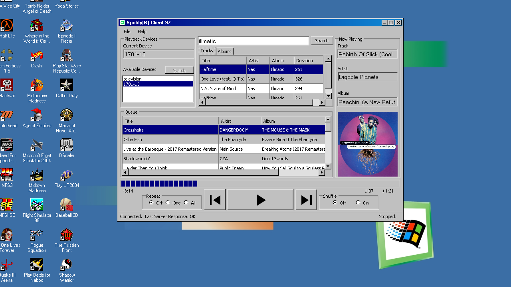
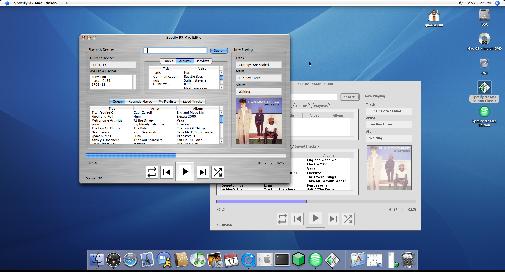

# Spotify(R) 97

A client-server system to control Spotify Connect devices from retro machines (Windows 95 and up or Mac OS 8.6-10.5) Requires Spotify Premium. Does not stream audio, only remote-controls other Spotify devices.

We've all been there: you're hard at work on your 98SE rig, your phone is in the other room, and Spotify sMaRt sHuFfLe plays a track that makes you want to pull your hair out. So you have to get up, find your phone, and tell it to play something else.

Well, the gentle laborer shall no longer suffer. With only some mildly complicated custom client-server infrastructure, Spotify(R) 97 allows you to control your Spotify Connect playback endpoints from the comfort of Windows 98. Or Mac OS 9. Or Windows 95. Or OS X. Or... actually that's it for now. OH WAIT! Mac OS 8!

{:.tree-view}
- [Spotify(R) 97](#spotifyr-97)
  - [Why](#why)
  - [What](#what)
  - [How](#how)
  - [How (to)](#how-to)
    - [Step 1 - Get Spotify app credentials](#step-1---get-spotify-app-credentials)
    - [Step 2 - Set up the Relay Server](#step-2---set-up-the-relay-server)
    - [Step 3 - Set up the client](#step-3---set-up-the-client)

## Why

Someone had to do it, obviously.

## What

This app DOES NOT stream any audio! This is only a UI you can use to remote control your other Spotify instances and Spotify Connect devices.

However, you could run this alongside [spotifyd](https://github.com/Spotifyd/spotifyd) on a Pi or similar and hook up its line out to your Sound Blaster's Line In and have an all in one retro Spotify solution. In theory the frontends could implement Windows Media Player or QuickTime player component to render an audio stream without much effort.

## How

Spotify(R) 97 consists of two components:

1. Relay Server
   - The Relay Server is a node.js app written in TypeScript which must be run on a 'modern' computer; that is to say, one new enough to be able to run a recent version of Node and make HTTPS requests to the Spotify API. Typically this is just the computer running Spotify that you want to remote control.
2. Client Application
   - The Client Application is a frontend for the Relay Server: you click Play in the Client, it sends a Play message to the Relay Server, the Relay Server calls the Spotify Connect API and tells it to start playing on the specified device.

## How (to)

### Step 1 - Get Spotify app credentials

[Follow the Spotify developer instructions to create an app](https://developer.spotify.com/documentation/web-api/tutorials/getting-started#create-an-app). You will need to copy the "Client ID" and "Client Secret" values into your Relay Server `.env` file, see [the server setup instructions](./server/).

**IMPORTANT:** The `redirect_uri` setting is very important. It must match *exactly* the URL you will use to access the server.

The default for this app is:

`http://localhost:3000/redirect`

If you change the port in the `.env` file, map ports using Docker, or are running the server remotely (e.g. over SSH) then you will need to replace the address and port as necessary to match your settings.

**Because this application is entirely unsecured, you should **NOT** run it in the cloud, and should not expose the port to the internet. Do not use a public IP with this server, only run this on your LAN**

### Step 2 - Set up the Relay Server

Server setup is covered in the [Server documentation](./server). Have your Spotify App Client ID and Secret handy.

### Step 3 - Set up the client

There are currently two clients. All clients, naturally, need an active network connection to the Relay Server.

[Spotify Client 97](./client/SpotifyClient97): for Windows 95 and up

[Spotify 97 Mac Edition](./client/Spotify97MacEdition): for Mac OS 8.6 - OS X 10.5
