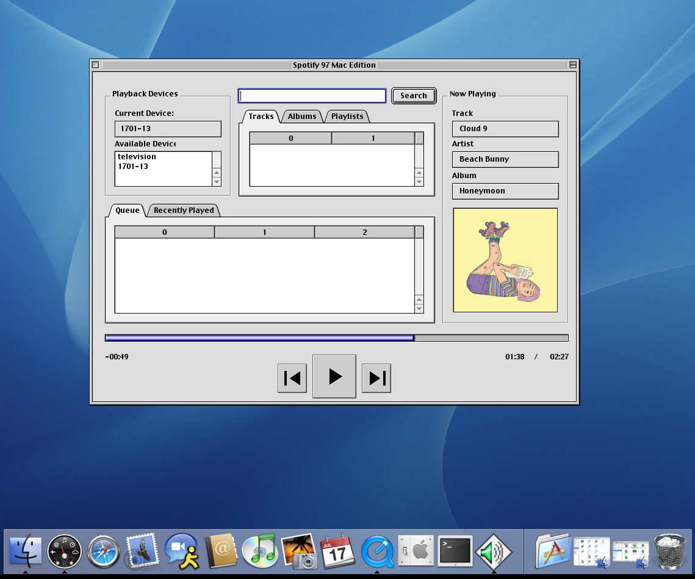

# Spotify 97 Macintosh Edition

Spotify 97 client for Mac OS 8.6-10.5 written in REALbasic 5.5

## Requirements

- PowerPC Mac
- Mac OS 8.6 - OS X 10.5 (tested on 9.2 and 10.4)
- Spotify Premium
- Spotify 97 Relay Server running on LAN
- Active TCP/IP networking (may need to install OpenTransport on OS 8/9)
- Recommended: Album Art display requires QuickTime

## Setup

On first run, you will be prompted to set your Relay Server address. Remember that this requires the protocol and port, for example: `http://192.168.1.29:3000`. See the Spotify 97 Relay Server documentation for details.

## Operation

If you are already listening to Spotify when you launch the application, it should automatically detect your current playback state.

If not, double click a device in the Device List to select it, then search for something to play and double-click it in the search results panel.

You can double-click a different device during playback to transfer playback from one device to another.

Clicking Play with no device selected will attempt to resume playback on your most recent device.

Double-clicking items in the Queue will play them immediately.

## Development

### I hate REALbasic

REALbasic sucks. I do not like it. I like that I can make the pretty brushed iTunes style UI, I like that I can write code that runs on ancient PowerPC Macs running OS 9. I like the idea that I could backport it to REALbasic 4 for OS 6-7 on proper old world 68k Macs. But I am not enjoying working with it.

### Architecture

Unlike .NET, the REALbasic application framework does not allow data bindings between arbitrary classes and arbitrary controls. There are provisions for custom bindings and notification interfaces but the effort involved is immense. This leaves the door open for very messy code, as opposed to our single-source-of-truth, automatically reactive UI in VB.NET.

To try and counter this, the `App` class functions as the main controller. `MainWindow` controls ask `App` to execute commands, `App` tells the `SpotifyClient` to transmit them. If the `Client` successfully calls the relay server, it calls an `App().set*` function with the new value. `App` then handles updating its internal state, AND it handles updating the relevant UI components. 

`MainWindow` should only contain the bare minimum code to display data and handle events.

`SpotifyClient` should not modify `App` properties or `MainWindow` controls directly.

There is nothing to enforce these conventions, so it takes a little care to follow them, but it has helped me so far keep things easily maintainable.
