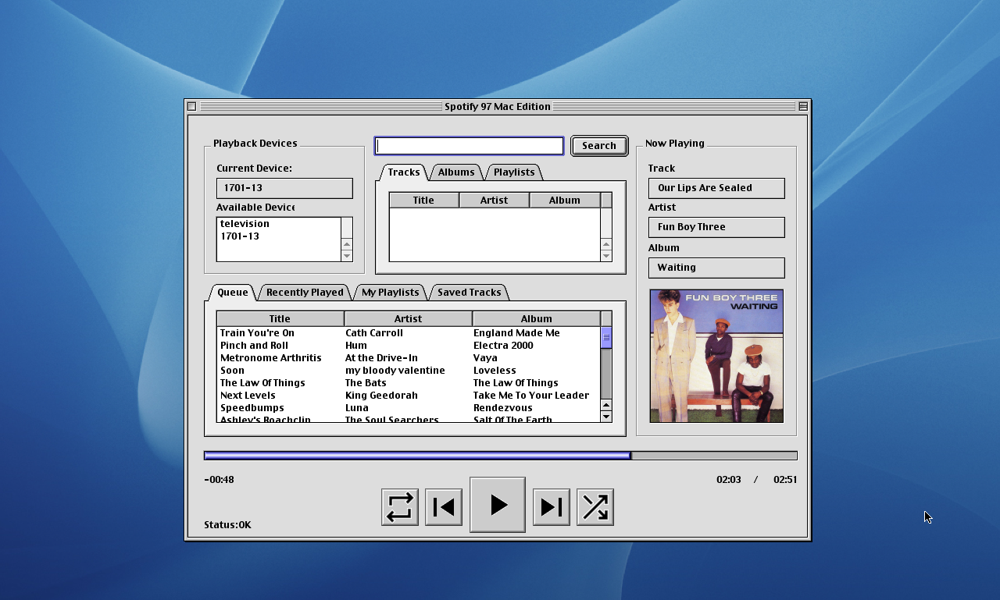
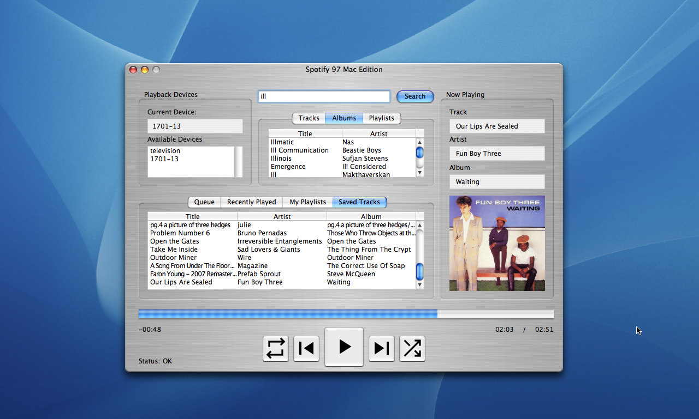

# Spotify 97 Macintosh Edition

Spotify 97 client for Mac OS 8.6-10.5 written in REALbasic 5.5. Uses [Charcoal Design's JSON Dictionary](http://www.charcoaldesign.co.uk/source/realbasic) package, backported to RB 5.5.

## Requirements

- PowerPC Mac with at least 16MB of RAM*
- Mac OS 8.6 - OS X 10.5 (tested on 9.2 and 10.4)
- 800x600 or higher screen resolution
- Spotify 97 Relay Server running on LAN
- Active TCP/IP networking (may need to install OpenTransport on OS 8/9)
- Recommended: Album Art display requires QuickTime

*this has not been extensively tested, but the app requires 4MB of available RAM at bare minimum, and may use 8MB or more.

*There is probably some awful memory leak somewhere :eek:*

## Setup

On first run, you will be prompted to set your Relay Server address. Remember that this requires the protocol and port, for example: `http://192.168.1.29:3000`. See the [main Spotify 97 documentation for details.](../../). The URL should be listed in the terminal output of the Relay Server, or in the browser where you logged into Spotify.

## Operation

If you are already listening to Spotify when you launch the application, it should automatically detect your current playback state.

If not, double click a device in the Device List to select it, then search for something to play and double-click it in the search results panel.

You can double-click a different device during playback to transfer playback from one device to another.

Clicking Play with no device selected will attempt to resume playback on your most recent device.

Double-clicking items in the Queue will play them immediately.

## Development

### I hate REALbasic

REALbasic sucks. I do not like it. I like that I can make the pretty brushed iTunes style UI, I like that I can write code that runs on ancient PowerPC Macs running OS 9. I like the idea that I could backport it to REALbasic 4 for OS 6-7 on proper old world 68k Macs. But I am not enjoying working with it. I hate that it won't composite the playback icons correctly on OS X, I hate that I have to wrap every single statement in an if/else or it'll crash or flicker or lag or whatever other undesirable behavior.

### Environment

Development with REALbasic 5.5.3 on Windows is probably most convenient, but for perfect UI layout you'll want to double check on OS X. Building for Mac on windows results in .bin files which OS X wants to treat as BinHex/StuffIt files. Best to build on Mac - I host my project on a shared SMB drive. Save project in Windows, load it in OS X, build it there.

### Architecture

Unlike .NET, the REALbasic application framework does not allow data bindings between arbitrary classes and arbitrary controls. There are provisions for custom bindings and notification interfaces but the effort involved is immense. I am too lazy to mess with all that, RB is just too unpleasant; this leaves the door open for very messy code, as opposed to our single-source-of-truth, automatically reactive UI in VB.NET.

To try and counter this, the `App` class functions as the main controller. `MainWindow` controls ask `App` to execute commands, `App` tells the `SpotifyClient` to transmit them. If the `Client` successfully calls the relay server, it calls an `App().set*` function with the new value. `App` then handles updating its internal state, AND it handles updating the relevant UI components.

`MainWindow` should only contain the bare minimum code to display data and handle events.

`SpotifyClient` should not modify `App` properties or `MainWindow` controls directly.

There is nothing to enforce these conventions, so it takes a little care to follow them, but it has helped me so far keep things easily maintainable.

### Grand Designs

REALbasic has been hard to learn. VB.NET was straightforward, as it is substantially more modern, more robust, and I've worked with it directly in the past. RB is trying to be VB6, but it's dollar store VB6.

So RB has a lot of functions that can only be accessed via the UI, and it has a very limited and inflexible event handling framework.

This is to say: You can only attach event listeners to objects which exist *in the context of a Window*. I did not figure this out until I was nearly done with the app, and so worked under the assumption that I just could not handle events on custom classes or non-control classes, like HTTPSocket.

So:

#### The Solution

If I were to rebuild it from scratch, I would do this:

1. Make a subclass of HTTPSocket which handles the ClientResponse wrapping
2. Drag instances of TCPSocket to the window, one for each endpoint (annoying) - make each one an instance of our custom HTTPSocket
3. Run each socket async (yield = true and timeout = undefined)
4. Socket event listeners handle their own UI/state updates

This would make the UI a little more "reactive" than it is currently, and it would make the HTTP calls truly asynchronous. This might make the UI more responsive and less laggy, but it might not - RB is just pretty slow at the end of the day. It was designed for small business database applications, not real-time network communications.
