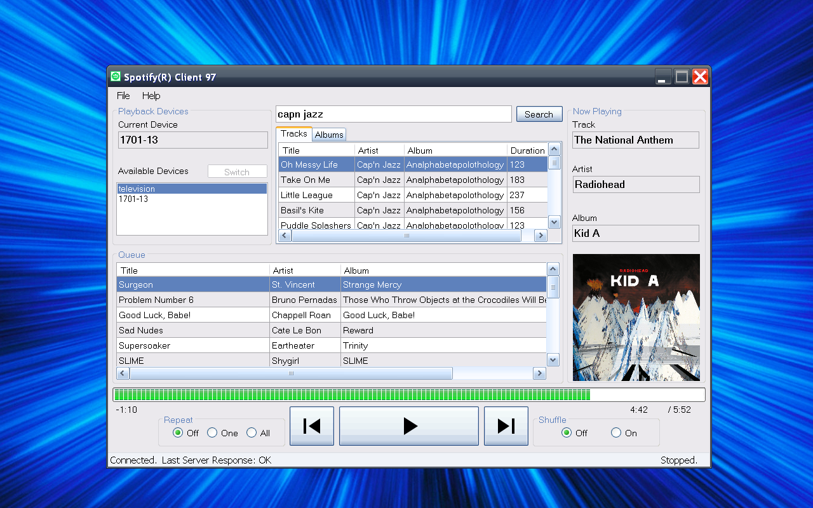

# Spotify Client 97

Frontend for Spotify 97 Relay Server written in VB.NET 2.0 for Windows 95 and up. Uses [Newtonsoft JSON.NET](https://newtonsoft.com/json)

## Requirements

- Windows 95/98/2k/XP
- .NET 2.0
- Active network connection to a [Spotify 97 Relay Server](../../server/README.md)
- (Recommended) 1024x768 or higher resolution monitor
- (Optional) Active internet connection

### Step 1: Install .NET

Install .NET Framework 2.0 (for Windows 95/98, use [MattKC's dotnet9x](https://github.com/itsmattkc/dotnet9x), otherwise, the Microsoft .NET 2.0 installer is widely available online)

### Step 2: Install Client Application

#### Option 1: Fully Automatic Online Installation

If your retro PC is connected to the internet, and is running Internet Explorer 5.5+, and has .NET 2.0 installed, you can install the app in "one click" here:

[http://retro.queenkjuul.xyz/spotifyclient97/publish.htm](http://retro.queenkjuul.xyz/spotifyclient97/publish.htm)

This method enables automatic updates, and installs a shortcut in your start menu to access the app

#### Option 2: Portable Standalone Binary

Download `SpotifyClient97Client-win32.zip` from the [Github Releases](https://github.com/queenkjuul/spotify97/releases/latest) page and unzip it
3. Run `Spotify Client 97.exe`

### Step 3: Configure the client

On initial run, the app will prompt you to set the Relay Server URL. Once this is defined, the app will restart. On XP you may get a Windows security warning here, just proceed.

The Server URL should have been printed in the terminal where you ran the Relay Server, or in the browser where you logged into Spotify. You need to include the full address including port, for example:

`http://192.168.1.29:3000`

Double click a device in the Available Devices list to select it. Select an item to play via the Search box, or hit Play to load that device's existing queue (if it has one).

## Long term goals

1. Keyboard Shortcuts
2. replace queue with tabbed layout to access recently played, maybe also playlists and saved tracks (implemented on Mac, Relay Server v1.2 offers these features)
3. Localization and accessibility
4. Modularize and clean up MainForm code
5. Grab and show recommended tracks and playlists
6. additional API features - track saving, artist info, lyrics
7. Extract SpotifyController and dependencies into a class library, build a Windows Mobile 6 frontend
8. ~~ClickOnce automatic updates (will need to set up HTTP retro access to a subdomain of queenkjuul.com first)~~ Done!
9. Marquee scrolling overflow on now playing texts
10. Additional preferences: add items to queue instead of immediately play, minimize to tray
11. ~~System tray icon~~ done :P
12. Rewrite in C#

## Development

### Client

The client is built in Visual Basic 2005 Express Edition. Downloads can be found online, but it is not supported in later versions of Windows. I use XP for development. Later editions of Visual Studio no longer support building installers for Windows 98, but you may be able to target .NET 2.0 in later versions and run it with MattKC's .NET 2.0 for Windows 9x.

Newtonsoft.Json is required to parse messages from the server. The DLL is provided with the client source code.
